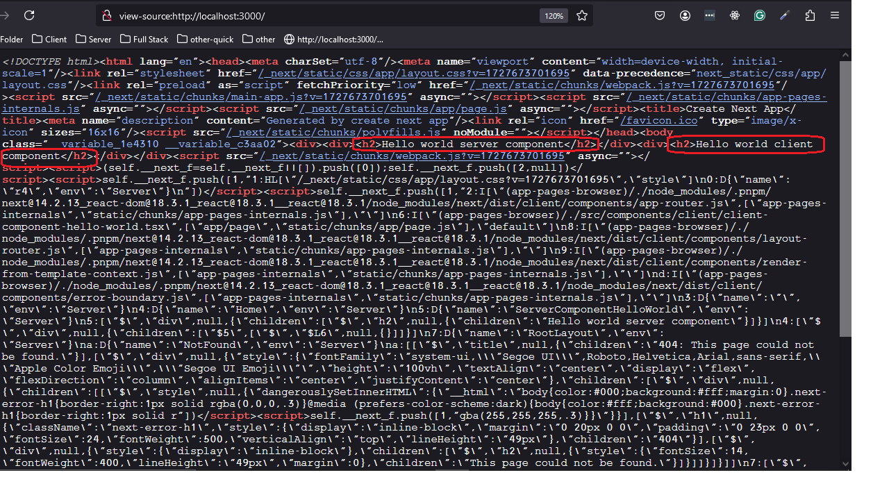
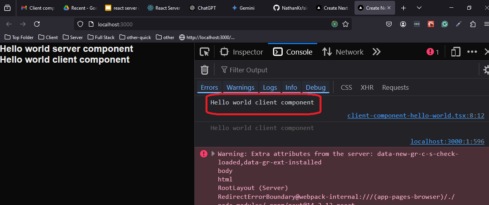
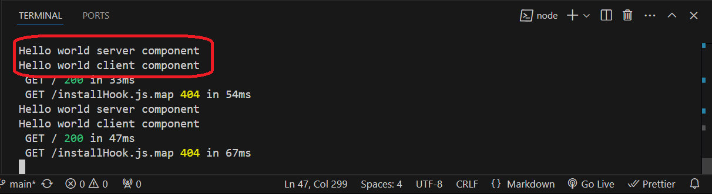

<h2 id="project-description">Project Description</h2>
<p>A concise and informative summary of the project's purpose, key features, and target audience.</p>

<h2 id="motivation">Motivation</h2>
Super simple example of using react server component

<h2 id="installation">Installation</h2>

```bash
pnpm i
```


<h2 id="usage">Usage</h2>


```bash
npm run dev
```


<h2 id="technologies-used">Technologies Used</h2>
next.js app router

<h2 id="code-structure">Code Structure</h2>
<p>An explanation of the project's code structure, including important files and directories.</p>

<h2 id="demo">Demo</h2>
<p>A link to a live demo or a GIF/video showcasing the project's functionality.</p>
<ul>
    <li>Live demo link</li>
    <li>GIF or video demonstration</li>
</ul>

<h2 id="points-of-interest">Points of Interest</h2>
<ul>
    <li>Innovative features</li>
    <li>Technical challenges and solutions</li>
    <li>Lessons learned</li>
</ul>

<h2>Open issues</h2>
<ul>
    <li>I am expecting to see the 'Hello world server component' of ServerComponentHelloWorld in view source but not 'Hello world client component' of ClientComponentHelloWorld. But in fact i see them both  why ?</li>
    <li>I am expecting to see in the browser console only 'Hello world client component' and thats what i get  but on the vscode (server?) console i expect to see only the console log of  'Hello world server component'  but i see also 'Hello world client component' check  - why</li>
</ul>

<h2 id="references">References</h2>
<ul>
    <li>External libraries or frameworks</li>
    <li>Articles or tutorials</li>
    <li>Other relevant resources</li>
</ul>

