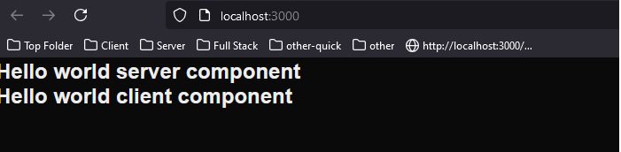

<h2>Project Overview</h2>
<p>This project showcases a basic example of using server and client components in a Next.js application. It explains how server and client components are rendered differently and demonstrates their behavior using logging and HTML view source examples.</p>

<h2>Project Description</h2>
<p>This is a simple React application demonstrating the use of server and client components in Next.js. The project includes two components: <code>ServerComponentHelloWorld</code> and <code>ClientComponentHelloWorld</code>, which exhibit different behavior during rendering and logging.</p>

<h2>Motivation</h2>
<p>To provide a minimal example of React Server and Client Components behavior, making it easier to understand the differences between server component and client component</p>


<h2>Installation</h2>

```bash
pnpm i
```


<h2 id="usage">Usage</h2>
 <p>Invoke this command to run the development server:</p>

```bash
npm run dev
```

This is the home page which uses both server and client components:

```ts
export default function Home() {
  return (
    <div>
      <ServerComponentHelloWorld />
      <ClientComponentHelloWorld />
    </div>
  );
}
```


<h2>Server component</h2>
By default, a component in Next.js is a server component unless explicitly marked otherwise

```ts
const ServerComponentHelloWorld : FC = () => {
    console.log('Hello world server component');
    return (
            <h2>Hello world server component</h2>
    );
};
```

<h2>Client component</h2>
<p>Use the <code>"use client"</code> directive to mark a component as a client component, which renders and logs on the client side:</p>

```ts
"use client"
import { FC } from "react";
const ClientComponentHelloWorld : FC = () => {
    console.log('Hello world client component');
    return (
            <h2>Hello world client component</h2>
    );
};
```


<h2>Demo - Browser</h2> <p>Here's a visual example of the application running in the browser:</p>  <h2>Demo - View Source</h2> <p>In the HTML source, I expected to see only the content from the server component. However, both <code>Hello world server component</code> and <code>Hello world client component</code> appear:</p>  <p>This happens because React tries to pre-render static content on the server and send it as HTML, even for client components. When a client component is purely static, it can be rendered on the server and displayed in the initial HTML source.</p> 

<h2>Demo - Console</h2> <p>In the browser console, I expected to see only <code>'Hello world client component'</code>, and that's what I got:</p>  <p>However, in the server console, I also see <code>'Hello world client component'</code> being logged along with the server component's log:</p>  <p>This is because React initially renders the component on the server, and then re-renders (hydrates) it on the client, causing duplicate logs in development.</p> 

<h2 id="references">References</h2> <ul> <li><a href='https://github.com/reactwg/server-components/discussions/4'> Why do Client Components get SSR'd to HTML?</a> - Dan Abramov, June 2023</li> <li><a href='https://react.dev/reference/rsc/server-components'>Server Components - React Official Documentation</a></li> <li><a href='https://nextjs.org/docs/basic-features/pages#pre-rendering'>Pre-rendering in Next.js</a> - Next.js Official Documentation</li> </ul> ```

