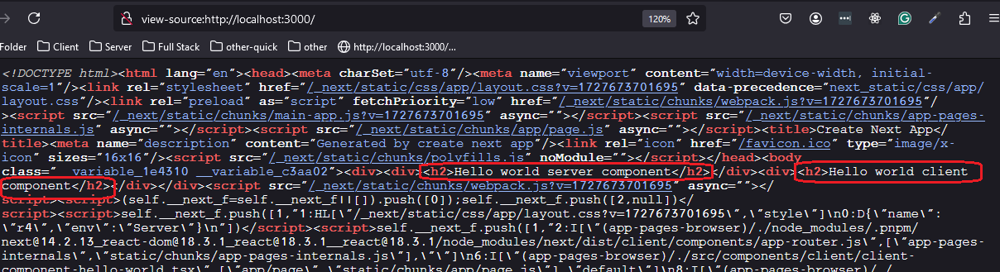
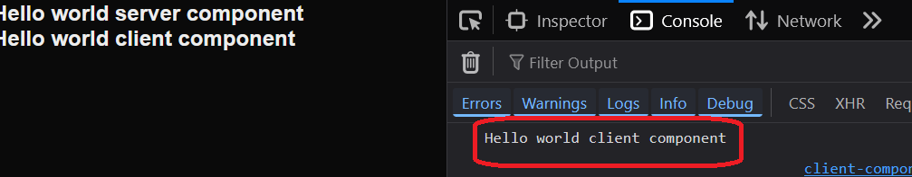

<h2>Project Description</h2>
.........

<h2>Motivation</h2>
Super simple example of using react server component and react client component

<h2>Installation</h2>

```bash
pnpm i
```


<h2 id="usage">Usage</h2>
Invoke this to run the development server

```bash
npm run dev
```

This is the home page

```ts
export default function Home() {
  return (
    <div>
      <ServerComponentHelloWorld />
      <ClientComponentHelloWorld />
    </div>
  );
}
```


<h2>Server component</h2>
In next.js by default a component is server component

```ts
const ServerComponentHelloWorld : FC = () => {
    console.log('Hello world server component');
    return (
            <h2>Hello world server component</h2>
    );
};
```

<h2>Client component</h2>
The directive "use client" is used to mark a component as client component 

```ts
"use client"
import { FC } from "react";
const ClientComponentHelloWorld : FC = () => {
    console.log('Hello world client component');
    return (
            <h2>Hello world client component</h2>
    );
};
```


<h2>Demo - Browser</h2>


<h2>Demo - View source</h2>
<p>I was expecting to see the 'Hello world server component' of ServerComponentHelloWorld in view source but not 'Hello world client component' of ClientComponentHelloWorld. But in fact i see them both  why ?</p>
<p>This is because react will try to convert the component to html if possible . In this case 'Hello world client component' is static so it can be converted to html on the server and sent to the browser - thats why we see it in view source</p>

<h2>Demo - Console</h2>
<p>I was expecting to see in the browser console only 'Hello world client component' and thats what i get  On the vscode server terminal i expect to see only the console log of 'Hello world server component'  but i see also 'Hello world client component' check  - why ?</p>
<p>What i have explained about view source is the answer also here </p>


<h2 id="references">References</h2>
<ul>
    <li><a href='https://github.com/reactwg/server-components/discussions/4'> Why do Client Components get SSR'd to HTML?</a>- Dan Abramov , June 2023</li>
    <li><a href='https://react.dev/reference/rsc/server-components'>server component - react offical docs</a></li>
</ul>

